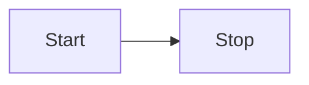

# Using Mermaid

This is an example showing how to use [Mermaid](https://mermaid.js.org/) to render diagrams in your
documentation.

Support is enabled by default through the [markdown2](https://github.com/trentm/python-markdown2)
library and `mermaid` fence blocks:

````markdown

````

A custom template is also required in order to include the Mermaid rendering code correctly. See [Using a Custom Template](../custom-template) for more information on customizing the generated
HTML in general.
